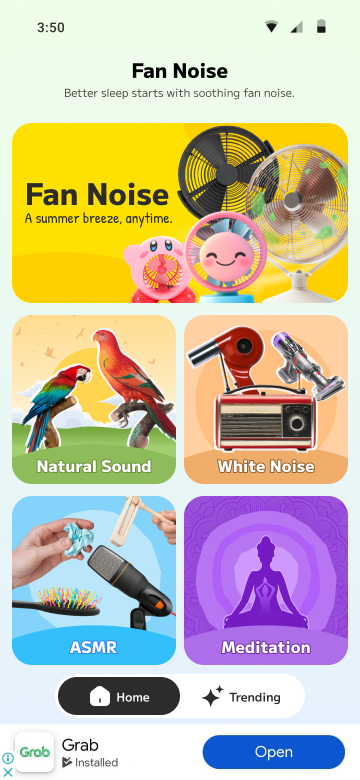

# Application name: Fan Noise 2025

- "I was struggling with my newborn babies sleep, shush, white noise, app does it for me".

- "I love it!!!, it helps my baby go to sleep so easily + love the fun songs".

- Little Sleeper promises a smooth onset to sleep with relaxing womb sounds, melodies and lullabies for babies who are at different development stages.

- Designed to build a secure and calm sleeping environment.

- We parents want our babies to have proper naps during the day and long sleep at night time. Relaxed, rested, and happy babies mean relaxed and happy mummies and daddies.

# Installation
```
pod install
```

# API:

https://api-fan-noise.kuemiin.com/api-docs/#/Sound/data-list

# SRS:

https://docs.google.com/...

# Data:

https://docs.google.com/spreadsheets/d/1S0UFJW07BEe9Ouu5LhjvJFpCPpUClRWllzfoomtI6eA/edit?gid=0#gid=0

# Design figma:

https://www.figma.com/design/iMLrbG9amZFrb3r9soffh6/Fan-Noises?node-id=0-1&t=4wYJbkvVVmcxKbfX-1



